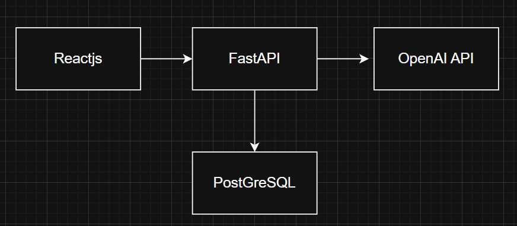

# Chat-PDF: High-Level Design Document

## 1. System Overview

Chat-PDF is an intelligent document interaction system that enables users to upload PDF files and engage in natural language conversations about their content. The application uses Retrieval Augmented Generation (RAG) to process documents, create searchable indices, and deliver relevant answers based on document content.

## 2. Architecture Diagram

## 3. Core Components

### 3.1 Frontend Application
- React-based single-page application for user interface
- Interactive components for file uploads, chat interface, and document management
- Secure authentication with `JWT` handling

### 3.2 Backend API Service
- `FastAPI` framework delivering RESTful endpoints
- Authentication service for user management
- PDF processing pipeline for document handling
- `RAG` implementation using `LangChain` framework
- `Vector` storage for semantic search capabilities

### 3.3 Database Layer
- PostgreSQL database for structured data storage
- Tables for user profiles, PDF metadata, and conversation history
- Binary storage for `serialized vector indices`

### 3.4 External Services
- OpenAI API providing `embeddings` and text generation
- `FAISS` library for efficient vector similarity search

## 4. Main Workflows

### 4.1 PDF Upload Flow
1. User uploads a PDF through the web interface
2. Backend validates the file format and structure
3. Text extraction process pulls content from PDF pages
4. Content is divided into manageable chunks with overlap
5. OpenAI generates `embeddings` for each text chunk
6. `FAISS` builds a searchable `vector` index
7. Database stores PDF information and serialized index

### 4.2 Question-Answering Flow
1. User submits a natural language question about a PDF
2. System retrieves the associated knowledge base
3. Question is used to find relevant document sections
4. Selected text chunks are assembled as context
5. Language model generates an answer using this context
6. System records the interaction in conversation history
7. User receives a contextually relevant response

### 4.3 Authentication Flow
1. User registers or logs in through the frontend
2. Backend validates credentials against stored data
3. System generates a JWT token for the authenticated session
4. Token is stored as an HTTP-only cookie for security
5. Protected API endpoints verify the token before processing requests

## 5. Data Storage

### 5.1 User Data
- Authentication credentials and profile information
- Securely hashed passwords 

### 5.2 PDF Storage
- Document metadata (filename, size, upload timestamp)
- Serialized knowledge bases for quick retrieval
- Relationships to user accounts and conversations

### 5.3 Conversation History
- Sequential record of user questions and system responses
- Timestamps for conversation tracking
- Associations with specific PDF documents