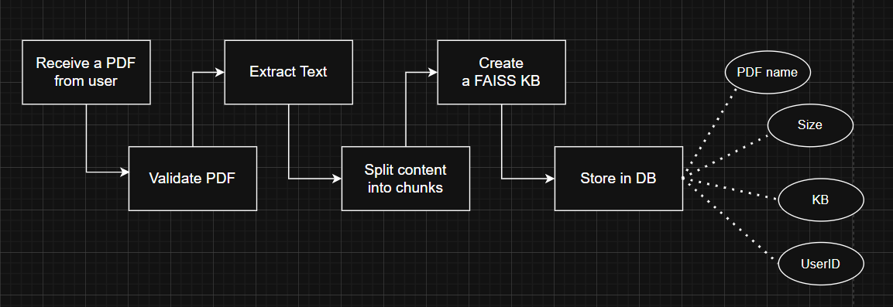
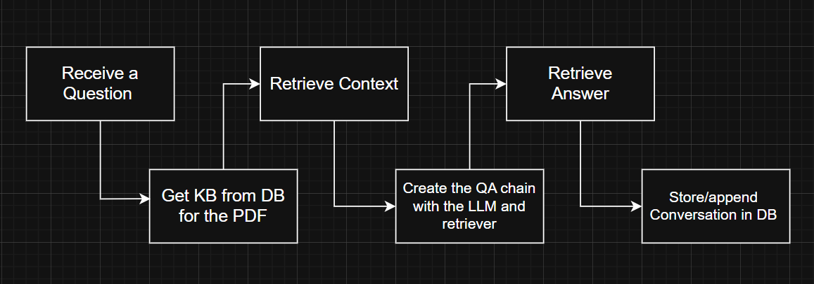

# Chat-PDF: Low-Level Design Document

## 1. Component Design

### 1.1 Database Schema

#### 1.1.1 Users Table
```sql
CREATE TABLE users (
    id VARCHAR PRIMARY KEY,
    email VARCHAR UNIQUE NOT NULL,
    name VARCHAR,
    password_hash VARCHAR NOT NULL,
    created_at TIMESTAMP DEFAULT CURRENT_TIMESTAMP
);
```

#### 1.1.2 PDFs Table
```sql
CREATE TABLE pdfs (
    id VARCHAR PRIMARY KEY,
    name VARCHAR NOT NULL,
    size INTEGER NOT NULL,
    uploaded_date TIMESTAMP DEFAULT CURRENT_TIMESTAMP,
    content BYTEA NOT NULL,
    user_id VARCHAR REFERENCES users(id) ON DELETE CASCADE
);
```

#### 1.1.3 Chat History Table
```sql
CREATE TABLE chat_histories (
    id VARCHAR PRIMARY KEY,
    pdf_id VARCHAR REFERENCES pdfs(id) ON DELETE CASCADE,
    conversation JSONB NOT NULL DEFAULT '[]',
    created_at TIMESTAMP DEFAULT CURRENT_TIMESTAMP
);
```

### 1.2 API Endpoint Specifications

#### 1.2.1 Authentication Endpoints

| Endpoint | Method | Description | Request Body | Response |
|----------|--------|-------------|-------------|----------|
| `/auth/register` | POST | Register a new user | `{email, password, name}` | `{message, user_id}` |
| `/auth/login` | POST | Login user | `{email, password}` | `{message, user_id, email}` + cookie |
| `/auth/logout` | POST | Logout user | None | `{message}` |
| `/auth/me` | GET | Get current user | None | `{id, email, name}` |

#### 1.2.2 PDF Management Endpoints

| Endpoint | Method | Description | Request Body | Response |
|----------|--------|-------------|-------------|----------|
| `/upload` | POST | Upload a PDF file | Form data with file | `{id, msg}` |
| `/pdfs` | GET | Get all PDFs | None | Array of PDF metadata |
| `/pdfs/{pdf_id}` | GET | Get single PDF | None | PDF metadata |
| `/pdfs/{pdf_id}` | DELETE | Delete PDF | None | `{msg}` |

#### 1.2.3 Conversation Endpoints

| Endpoint | Method | Description | Request Body | Response |
|----------|--------|-------------|-------------|----------|
| `/chat` | POST | Ask question | `{question, pdf_id, conversation_id?}` | `{answer, conversation_id}` |
| `/conversations/{pdf_id}` | GET | Get conversations | None | Array of conversation history |

## 2. Process Flows

### 2.1 PDF Upload Process



1. Controller receives uploaded file
2. Validator checks if file is PDF format
3. PDF text extraction process:
   - Create PDF reader object
   - Extract text from each page
   - Concatenate all text
4. Text processing:
   - Split text into chunks (2000 chars with 200 overlap)
   - Create embeddings using OpenAI API
   - Build FAISS index
5. Database operations:
   - Serialize FAISS index
   - Store PDF metadata and serialized index
   - Return success response with PDF ID

### 2.2 Question Processing Flow



1. Controller receives question, PDF ID, and optional conversation ID
2. Database operations:
   - Retrieve PDF record
   - Deserialize knowledge base
   - Get or create conversation
3. RAG process:
   - Create retriever from knowledge base
   - Set up prompt template
   - Configure QA chain with LLM
4. Answer generation:
   - Run question through QA chain
   - Track token usage
5. Update conversation:
   - Add Q&A pair to history
   - Save to database
   - Return answer to user
